# Secure-CCL

Secure-CCL es una plataforma IAM/IGA completa desarrollada como proyecto personal, que integra tecnologías enterprise de gestión de identidades y accesos sobre una infraestructura dockerizada. El proyecto demuestra el ciclo de vida completo de identidades, desde el directorio LDAP hasta la gobernanza de roles, pasando por autenticación federada, aprovisionamiento automático y flujos de solicitud de acceso.

## Tecnologías utilizadas

| Tecnología | Función |
|---|---|
| OpenLDAP (osixia) | Directorio de identidades |
| Keycloak 24 | Identity Provider — SSO, OAuth2/OIDC |
| MidPoint (Evolveum) | IGA Engine — Gobernanza de identidades |
| .NET 9 | Backend REST — API protegida con JWT |
| Angular 18 | Frontend — SPA con autenticación Keycloak |
| Python Flask | Microservicio LDAP — operaciones sobre el directorio |
| PostgreSQL 16 | Base de datos de MidPoint |
| Docker Compose | Orquestación completa de servicios |

---

## Arquitectura

```
Secure-CCL/
├── keycloak/
│   ├── 2cl-realm.json          # Partial export del Realm (grupos, roles, federación)
│   └── themes/custom/login/    # Tema personalizado de login
├── ldap/
│   └── ldif/
│       └── 50-users.ldif       # 45 usuarios distribuidos en 5 departamentos
├── ldap-service/
│   ├── ldap-service.py         # Microservicio Flask para operaciones LDAP
│   └── Dockerfile
├── midpoint/
│   ├── ldap-resource.xml       # Conector LDAP para MidPoint
│   └── object-template.xml     # Template de asignación automática de roles
├── my-angular-keycloak-app/    # Aplicación Angular
├── SecureApi/                  # API .NET 9
├── scripts/
│   ├── jml.py                  # Joiner/Mover/Leaver — ciclo de vida de identidades
│   └── assign_groups.py        # Asignación masiva de grupos en Keycloak
├── docker-compose.yml
├── .env.example
└── screenshots/
```

---

## Key Features (IGA & Advanced IAM)

- Full Identity Lifecycle (JML): Automatización de los procesos de Joiner, Mover y Leaver mediante scripts CLI interconectados con el directorio raíz.

- IGA Engine (Evolveum MidPoint): Implementación de un motor de gobernanza para la reconciliación de cuentas, gestión de recursos LDAP y aprovisionamiento automático de roles basado en atributos.

- Advanced Policy Enforcement (SoD): Configuración de reglas de Segregación de Funciones (ej. exclusión mutua entre role_admin y role_employee) para garantizar el cumplimiento normativo y evitar conflictos de privilegios.

- Delegated Access Governance: Flujo de trabajo de Access Request con aprobación delegada, permitiendo que los "Jefes de Área" gestionen el acceso de sus departamentos de forma autónoma a través de una interfaz Angular/ .NET 9.

- Hybrid Identity Federation: Autenticación centralizada SSO mediante Keycloak (OIDC/OAuth2), integrando federación con OpenLDAP y proveedores externos como Google SSO.

- Automated Role Mapping: Asignación dinámica de roles mediante lógica Groovy en el Object Template de MidPoint, vinculando la estructura organizativa (OU) con privilegios efectivos en el sistema.

---

## Servicios y puertos

| Servicio | Puerto | Credenciales por defecto |
|---|---|---|
| Angular App | 4200 | Usuarios del LDAP |
| Keycloak | 8080 | admin / ver .env |
| SecureApi | 5001 | — (JWT) |
| MidPoint | 8090 | administrator / ver .env |
| OpenLDAP | 389 | cn=admin / ver .env |
| LDAP Service | 5050 | API Key en .env |

---

## Requisitos

- [Docker Desktop](https://www.docker.com/)
- [Git](https://git-scm.com/)
- Python 3.x + `pip install requests ldap3` (para los scripts)
- Navegador moderno

---

## Instalación y puesta en marcha

### 1. Clonar el repositorio

```bash
git clone https://github.com/Kaesar88/SecureCCL.git
cd SecureCCL
```

### 2. Configurar variables de entorno

```bash
cp .env.example .env
```

Edita `.env` con tus valores:

```env
LDAP_ADMIN_PASSWORD=tu_password
KEYCLOAK_ADMIN_PASSWORD=tu_password
MIDPOINT_DB_PASSWORD=tu_password
MIDPOINT_ADMIN_PASSWORD=tu_password
LDAP_SERVICE_API_KEY=tu_api_key
```

### 3. Levantar los contenedores

```bash
docker compose up -d --build
```

### 4. Verificar que todos los servicios están corriendo

```bash
docker ps
```

Deberían aparecer 7 contenedores activos: `openldap`, `secure_keycloak`, `secure_api`, `angular_app`, `ldap-service`, `midpoint-server`, `midpoint-db`.

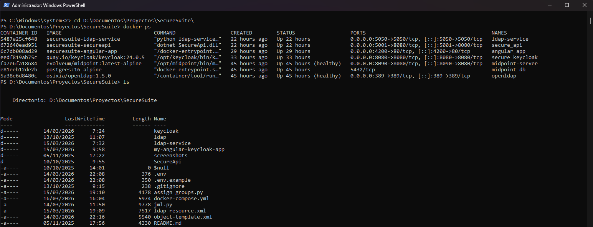

### 5. Configuración manual post-arranque

Tras el primer arranque o tras `docker compose down -v`:

**Keycloak:**
1. Accede a `http://localhost:8080` → realm `2cl-realm` → **User Federation → LDAP**
2. Introduce el `bindCredential` (contraseña LDAP del `.env`)
3. Pulsa **Test connection** y **Test authentication** — deben salir en verde
4. Pulsa **Synchronize all users**
5. Ve a **Identity Providers → Google** e introduce el `clientSecret` de Google Cloud Console

**Asignación de grupos:**
```bash
python scripts/assign_groups.py
```

**MidPoint** (`http://localhost:8090`, usuario `administrator`):
1. **Resources → Import resource definition** → sube `midpoint/ldap-resource.xml`
2. **Import object** → sube `midpoint/object-template.xml`
3. En el recurso → **Accounts → Tasks → Import** para traer los usuarios
4. **System Configuration → Policies → Object policies** → añade policy `UserType` con `Secure-CCL User Template`
5. **Server Tasks → Reconciliation tasks** → crea y ejecuta la tarea de reconciliación

---

## Funcionalidades implementadas

### Autenticación y SSO

- Login con usuario y contraseña federado contra OpenLDAP
- Login con Google (SSO) mediante Identity Provider de Keycloak
- Tema de login personalizado
- Tokens JWT con roles en `realm_access.roles`


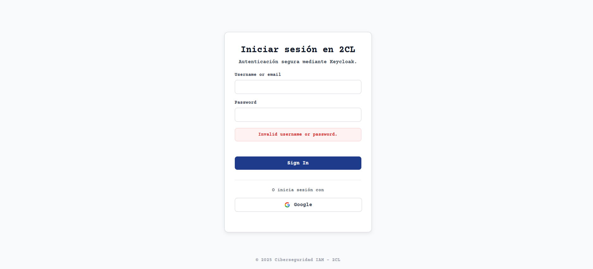

### Sistema de roles

El sistema implementa control de acceso granular con los siguientes roles:

| Rol | Descripción |
|---|---|
| `role_employee` | Empleado estándar |
| `role_manager` | Manager con acceso elevado |
| `role_admin` | Administrador global |
| `role_manager_ventas` | Jefe de área de ventas |
| `role_manager_tecnologia` | Jefe de área de tecnología |
| `role_manager_recursos` | Jefe de área de recursos |
| `role_manager_finanzas` | Jefe de área de finanzas |
| `role_manager_direccion` | Jefe de área de dirección |

Los roles se asignan automáticamente según el departamento (OU) del usuario en el LDAP, gestionados por el Object Template de MidPoint.

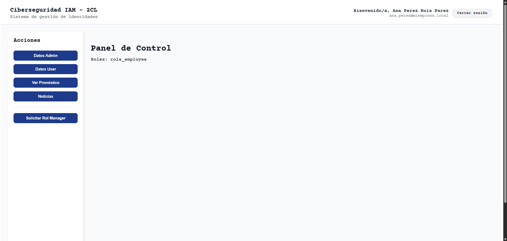
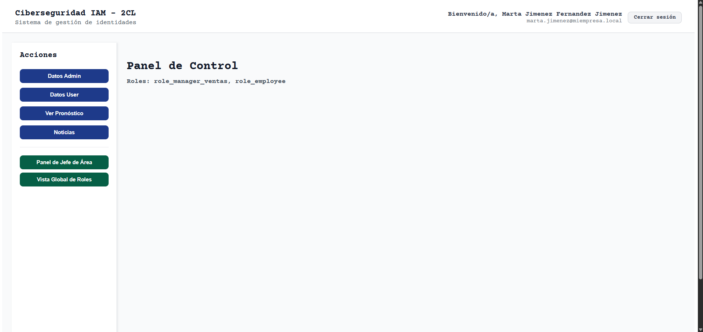

### Grupos Keycloak

Cada departamento tiene su grupo con roles asignados. Los usuarios se asignan automáticamente a su grupo mediante el script `assign_groups.py` que lee el atributo `ou` del LDAP.

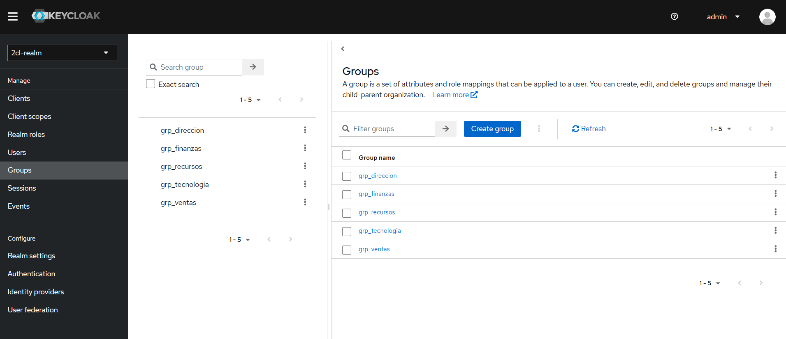
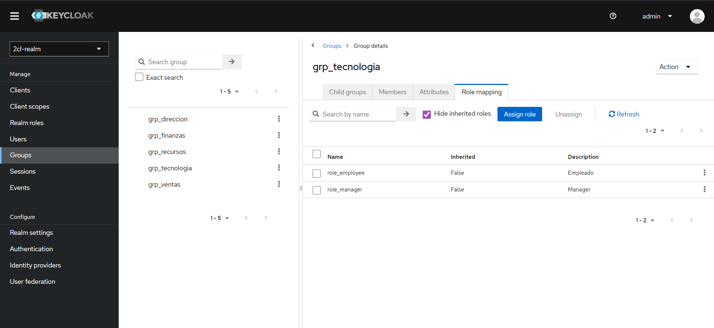

### Federación LDAP

45 usuarios distribuidos en 5 departamentos (`ventas`, `tecnologia`, `recursos`, `finanzas`, `direccion`) con autenticación federada contra OpenLDAP.


### Access Request — Solicitud de rol de Manager

Flujo completo de solicitud y aprobación de acceso:

1. El empleado envía una solicitud con justificación desde la aplicación Angular
2. El administrador o jefe de área revisa y aprueba o rechaza
3. Al aprobar, el microservicio LDAP escribe el rol en el directorio
4. MidPoint detecta el cambio en el siguiente Reconcile y asigna el rol

Validaciones implementadas:
- Solo `role_employee` puede solicitar `role_manager`
- No puede haber dos solicitudes pendientes del mismo usuario
- El jefe de área solo puede aprobar solicitudes de su propio departamento

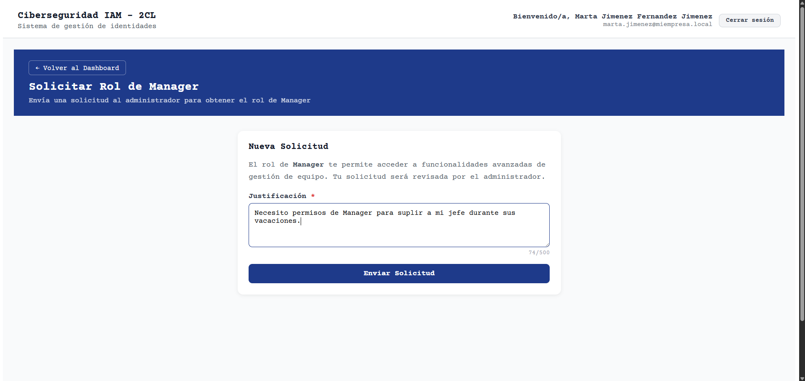
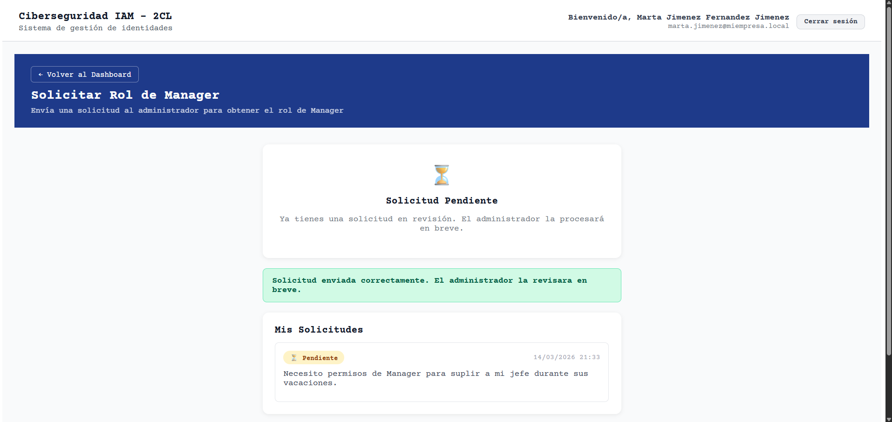
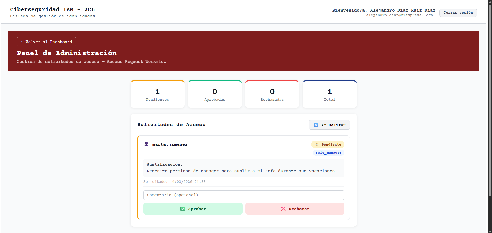
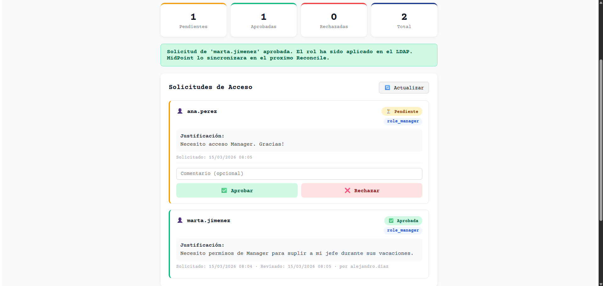
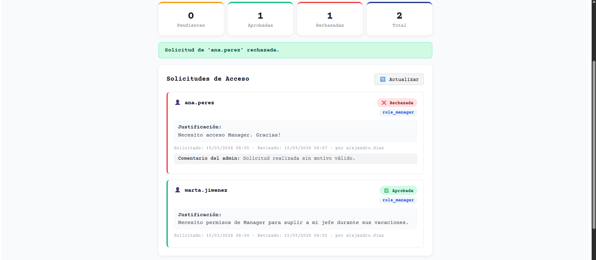
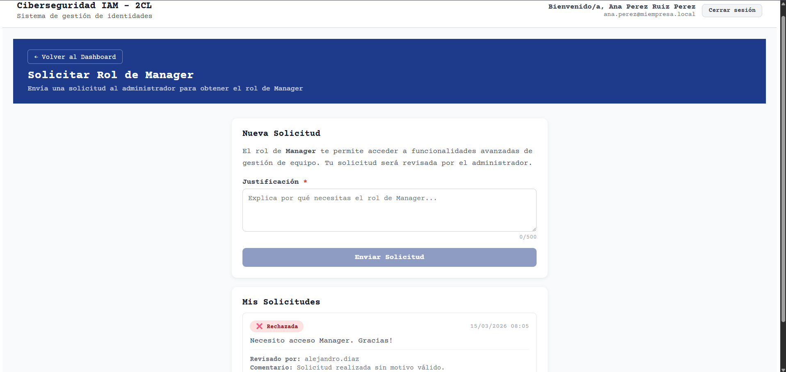

### Panel de Jefe de Área

Cada jefe de área tiene acceso a un dashboard de su departamento con KPIs, tabla detallada del personal con roles y estado, y gestión de solicitudes de acceso de su equipo.

Los roles de jefe de área son granulares por departamento (`role_manager_ventas`, `role_manager_tecnologia`, etc.), garantizando que cada manager solo puede ver y gestionar a su propio equipo. Los datos de usuarios se obtienen dinámicamente del LDAP a través del microservicio Python.

| Departamento | Jefe de área |
|---|---|
| ventas | marta.jimenez |
| tecnologia | fernando.perez |
| recursos | laura.rodriguez |
| finanzas | david.alvarez |
| direccion | miguel.torres |

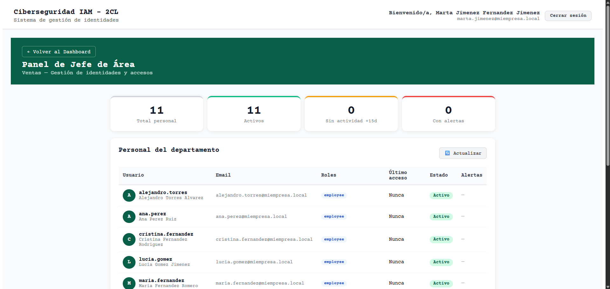

### Vista Global de Roles

Disponible para todos los jefes de área y managers, muestra el inventario completo de roles por departamento en formato desplegable.

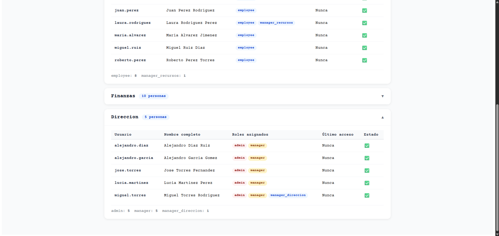
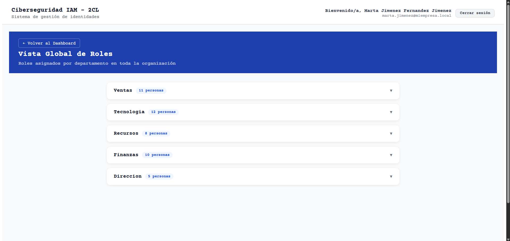

---

## MidPoint — IGA Engine

### Recurso LDAP

Conector configurado con el conector Polygon LDAP moderno (`ri:dn`) apuntando al OpenLDAP con mappings inbound: `uid`, `cn`, `sn`, `mail`, `ou` → `organizationalUnit`.

### Object Template

Asignación automática de roles mediante scripts Groovy con `basic.stringify()`:

| Condición | Roles asignados |
|---|---|
| `ou = direccion` | `role_admin` + `role_manager` |
| `ou = tecnologia` | `role_employee` + `role_manager` |
| `ou = ventas/recursos/finanzas` | `role_employee` |
| `description = role_manager` | `role_manager` (por Access Request aprobado) |

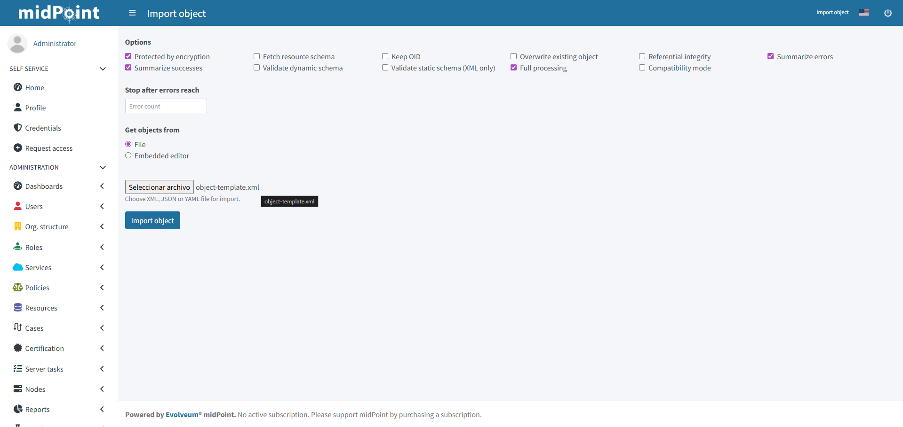
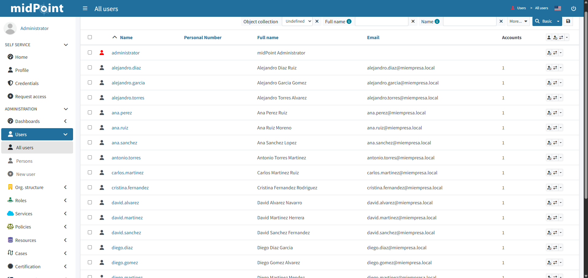
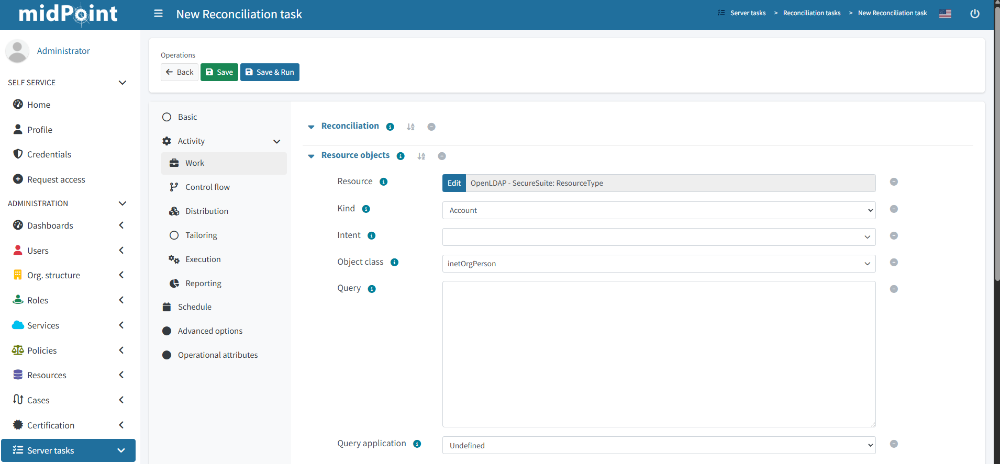

### Segregation of Duties (SoD)

Regla configurada en `role_admin` que impide asignar simultáneamente `role_admin` y `role_employee`. MidPoint bloquea la asignación con un mensaje de violación de política.

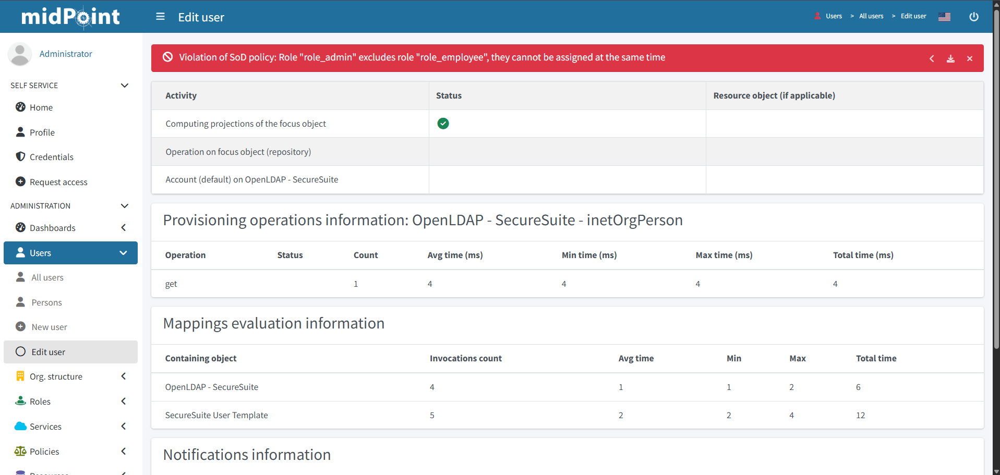

---

## Scripts de gestión

### jml.py — Joiner / Mover / Leaver

Script CLI interactivo para simular el ciclo de vida de identidades directamente sobre el LDAP:

```bash
pip install ldap3
python scripts/jml.py
```

- **Joiner**: crea un nuevo usuario en el departamento indicado
- **Mover**: cambia al usuario de departamento — MidPoint reasigna roles automáticamente en el siguiente Reconcile
- **Leaver**: deshabilita o elimina la cuenta del usuario

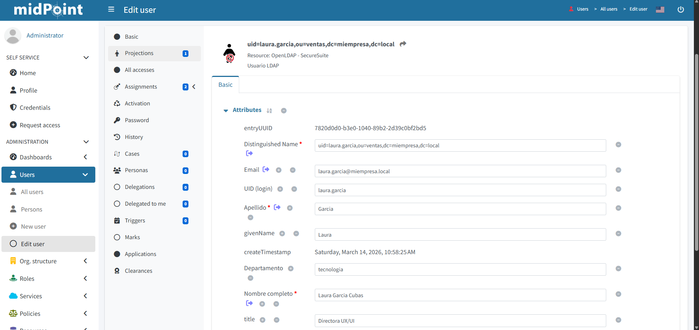
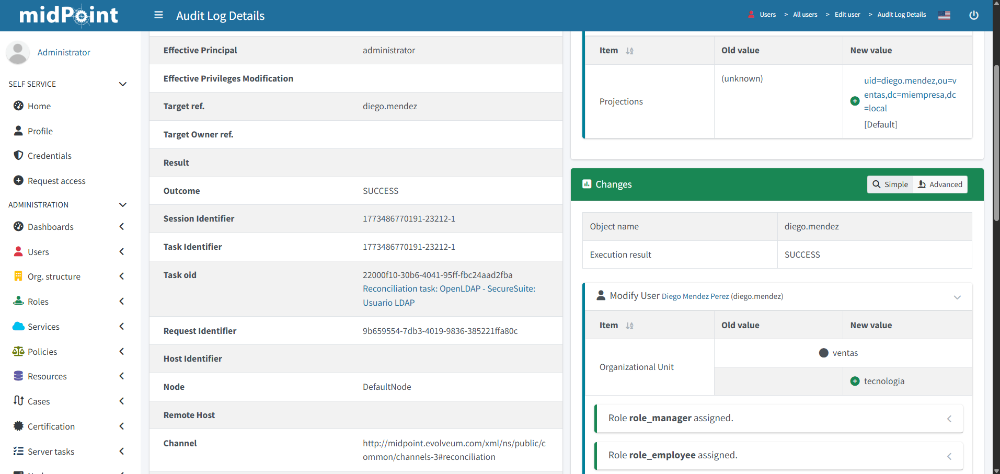

### assign_groups.py

Asigna masivamente los usuarios de Keycloak a sus grupos según el atributo `ou` del LDAP. Necesario ejecutar tras cada `docker compose down -v`.

```bash
pip install requests
python scripts/assign_groups.py
```

---

## Usuarios de prueba

El fichero `ldap/ldif/50-users.ldif` contiene 45 usuarios distribuidos en 5 departamentos con contraseñas hasheadas (SSHA). Las contraseñas siguen el formato `Pass{Apellido}123!` ,para uso en entorno de prueba local, reemplazar el archivo por una versión en texto claro.

---

## Comandos útiles

```bash
# Ver contenedores activos
docker ps

# Ver logs de un servicio
docker compose logs secure_keycloak
docker compose logs midpoint-server

# Parar sin perder datos
docker compose down

# Parar y borrar volúmenes (reset completo)
docker compose down -v

# Reconstruir un servicio
docker compose up -d --build secureapi

# Recargar contraseñas LDAP manualmente
docker cp reset-passwords.ldif openldap:/tmp/reset-passwords.ldif
docker exec openldap ldapmodify -x -H ldap://localhost -D "cn=admin,dc=miempresa,dc=local" -w TU_PASSWORD -f /tmp/reset-passwords.ldif
```

---

## Configuración de Google SSO

1. Crear un proyecto en [Google Cloud Console](https://console.cloud.google.com)
2. Activar la API de Google+
3. Crear credenciales OAuth 2.0 (tipo: Aplicación web)
4. Añadir URI de redirección: `http://localhost:8080/realms/2cl-realm/broker/google/endpoint`
5. En Keycloak → **Identity Providers → Google** → introducir Client ID y Client Secret

---

## Notas

- Todos los servicios corren en Docker, no se requiere instalación local de Node.js, Angular o .NET.
- El fichero `2cl-realm.json` es un Partial Export de Keycloak. Los secrets de clientes y credenciales LDAP están enmascarados y deben introducirse manualmente tras cada reinicio con `down -v`.
- El tema personalizado de Keycloak se monta como volumen. Los cambios en los ficheros del tema se reflejan al recargar la página.
- MidPoint requiere configuración manual tras cada reinicio completo — ver sección "Configuración manual post-arranque".

---

## Autor

[Kaesar88](https://github.com/Kaesar88)
