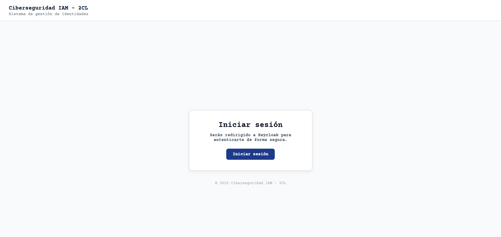
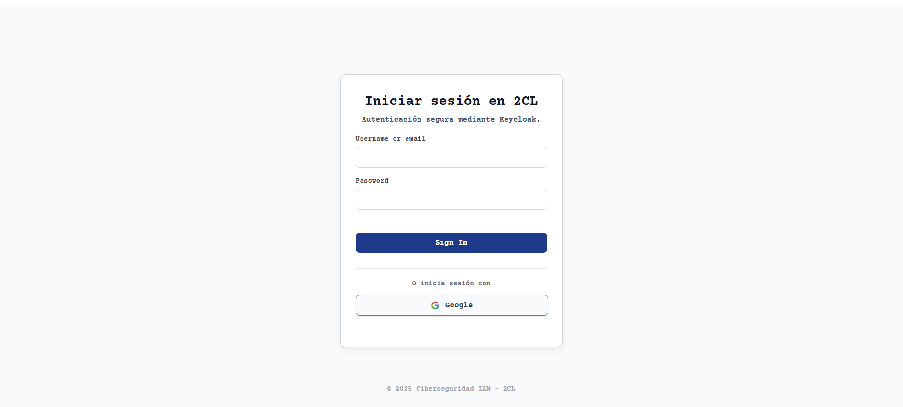
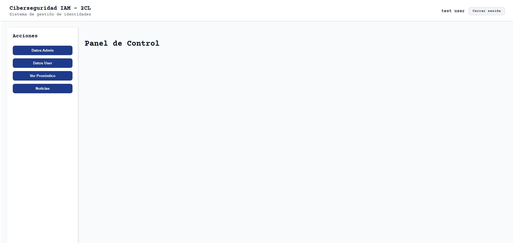
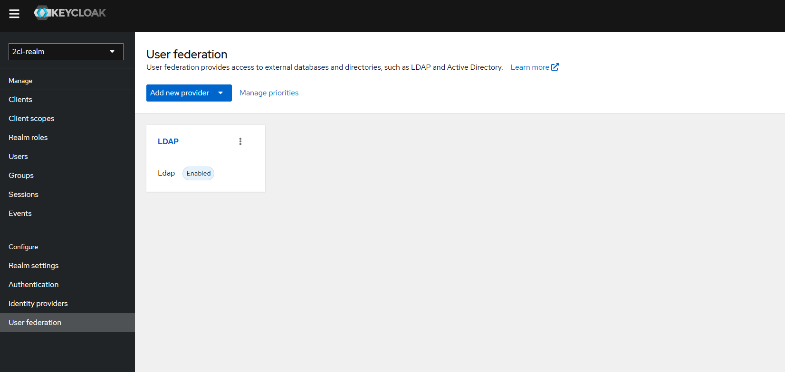
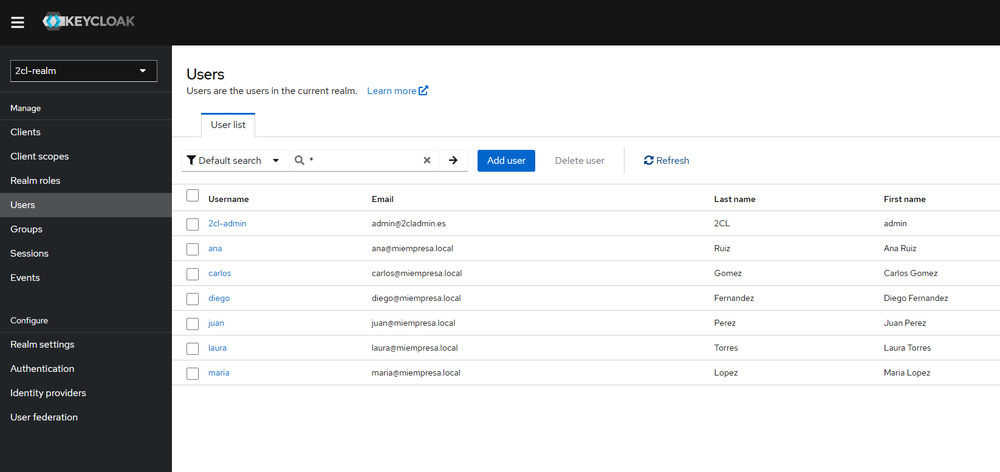
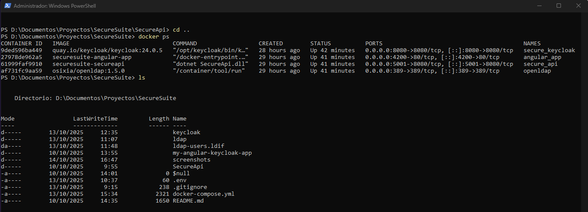

## SecureSuite

SecureSuite es un proyecto personal de integración de Keycloak, una aplicación Angular y una API .NET, usando Docker Compose para un despliegue completo y reproducible. Incluye integración con **OpenLDAP (osixia/openldap)** para federación de usuarios y gestión de identidades.


## Estructura del proyecto

```SecureSuite/
├── keycloak/                # Configuración de Keycloak y export del Realm
│   └── 2cl-realm.json       # Partial export del Realm
├── ldap/ldif/               # Usuarios y OUs para pruebas
│   └── 50-users.ldif
├── my-angular-keycloak-app/ # Aplicación Angular
├── SecureApi/               # API .NET
├── docker-compose.yml       # Orquestador de contenedores
├── .env                     # Variables de entorno (contraseñas, etc.)
└── screenshots/             # Capturas de pantalla
```


## Requisitos

- [Docker](https://www.docker.com/)
- [Docker Compose](https://docs.docker.com/compose/)
- [Git](https://git-scm.com/)
- Navegador moderno (Chrome, Edge, Firefox, etc.)


## Montaje del proyecto

1. Clonar este repositorio:
git clone https://github.com/Kaesar88/SecureSuite.git
cd SecureSuite

2. Configurar las variables del entorno en .env (ya incluido)
LDAP_ADMIN_PASSWORD=Secret123
KEYCLOAK_ADMIN_PASSWORD=admin

3. Construir y levantar los contenedores:
docker-compose up --build

4. Acceder a la aplicación Angular:
URL: http://localhost:4200

5. Acceder a la API (si es necesario):
URL: http://localhost:5001


## Configuración de Keycloak

Realm: 2cl-realm (keycloak/2cl-realm.json)
Clientes y roles configurados según el proyecto Angular y la API .NET.
Federación LDAP habilitada usando **OpenLDAP (osixia/openldap)** para los usuarios definidos en 50-users.ldif.


## Usuarios de prueba (LDIF)

| Usuario | OU        | Email                  | Contraseña     |
|---------|-----------|------------------------|----------------|
| juan    | ventas    | juan@miempresa.local   | JuanPass123    |
| maria   | tecnologia| maria@miempresa.local  | MariaPass123   |
| carlos  | recursos  | carlos@miempresa.local | CarlosPass123  |
| ana     | ventas    | ana@miempresa.local    | AnaPass123     |
| diego   | tecnologia| diego@miempresa.local  | DiegoPass123   |
| laura   | recursos  | laura@miempresa.local  | LauraPass123   |


## Capturas de pantalla

Login:

(SS de la pantalla principal de la aplicación Angular, antes de redirigir al login de Keycloak.)

Login en Keycloak:

(SS de la pantalla de login de Keycloak a la que redirige la aplicación Angular.)

Dashboard:

(SS del dashboard mostrado tras el login exitoso, con el usuario autenticado visible.)

Federation LDAP:

(SS de User Federation de Keycloak con LDAP activado (osixia/openldap).)

Lista de usuarios:

(SS de la lista de importados desde LDAP mediante la federación.)

Docker ps + estructura:

(SS de PowerShell mostrando contenedores activos y estructura principal del proyecto.)


## Comandos Docker útiles:

Ver contenedores corriendo
`docker-compose ps`

Ver logs de un servicio
`docker-compose logs secure_keycloak`
`docker-compose logs angular_app`

Reiniciar solo Keycloak
`docker-compose up -d keycloak`

Limpiar volúmenes (⚠️ Borra datos)
`docker-compose down -v`

Reconstruir todo
`docker-compose down`
`docker-compose up --build -d`


## Notas

Todos los servicios se ejecutan en contenedores Docker, por lo que no se requiere instalación local de Node.js, Angular o .NET.

Se puede modificar docker-compose.yml para personalizar puertos, volúmenes o variables de entorno.

Debido a cambios en client secrets al recrear clientes, si se vuelve a levantar el proyecto desde cero, puede ser necesario actualizar los secrets en Angular (environment.ts) y API (appsettings.json).

El Realm exportado (2cl-realm.json) es un Partial Export incluyendo grupos y clientes.


## Autor
Kaesar88
